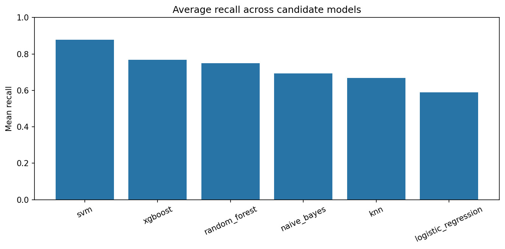
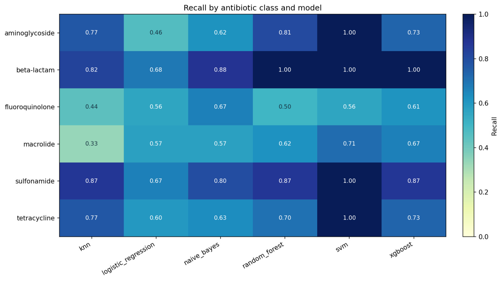
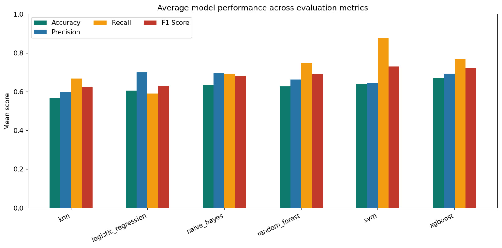
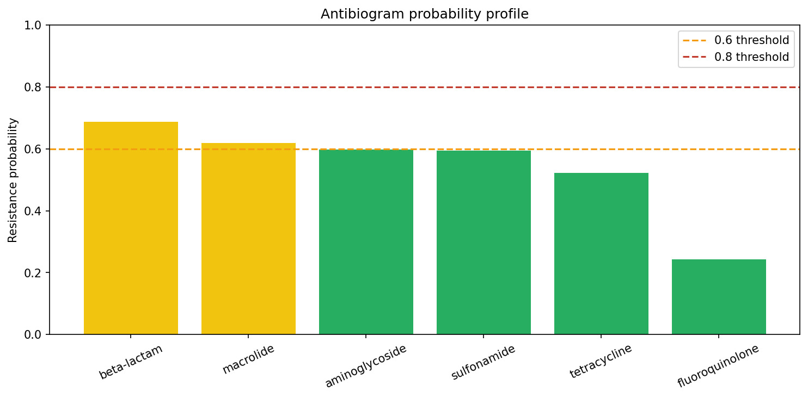
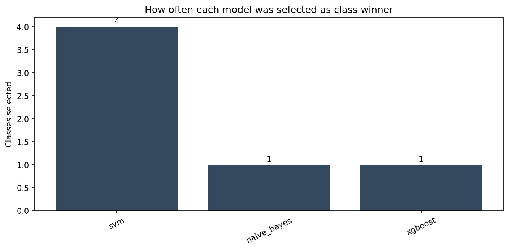
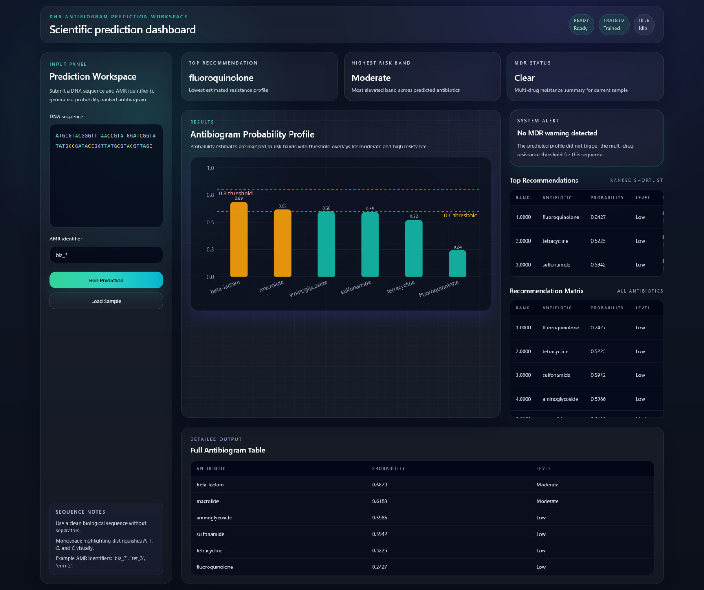

# ASAP-ML

ASAP-ML is a production-style Python project for antibiotic susceptibility prediction, antibiogram generation, and antibiotic recommendation. It follows the workflow described in *Antibiotic Susceptibility and Antibiogram Prediction* and extends it with a recommendation engine that ranks safer antibiotic options from predicted resistance probabilities. The application layer is now a React frontend backed by a FastAPI service.

## Project Screenshots

<p align="center">
  <br><br>
  <br><br>
  <br><br>
  <br><br>
  <br><br>
  
</p>


## Workflow

1. Generate synthetic FASTA-style AMR gene sequences in `data/sequences.fasta`
2. Convert FASTA entries into `data/dataset.csv`
3. Encode:
   - `gene_sequence` with character-level 2-grams
   - `amr_identifier` with character-level 1-grams
4. Split the dataset and fit vectorizers on training data only
5. Train Random Forest, XGBoost, SVM, KNN, Logistic Regression, and Naive Bayes with 5-fold `GridSearchCV`
6. Select the best model for each antibiotic class using:
   - highest recall
   - highest accuracy as the tie-breaker
7. Generate an antibiogram with probability bands
8. Produce ranked antibiotic recommendations and MDR warnings

## Project Structure

```text
project/
├── data/
│   ├── sequences.fasta
│   └── dataset.csv
├── src/
│   ├── data_generation.py
│   ├── preprocessing.py
│   ├── models.py
│   ├── evaluation.py
│   ├── model_selection.py
│   ├── antibiogram.py
│   ├── recommendation.py
│   ├── visualization.py
│   └── utils.py
├── app/
│   └── app.py
├── outputs/
│   ├── models/
│   ├── charts/
│   └── results/
├── requirements.txt
└── README.md
```

## Installation

```bash
cd project
python -m venv .venv
.venv\Scripts\activate
pip install -r requirements.txt
```

## Generate Data

```bash
python src/data_generation.py --num-sequences 1400 --fasta-path data/sequences.fasta --csv-path data/dataset.csv
```

## Train Models

```bash
python src/run_pipeline.py --num-sequences 1400 --seed 42
```

## Predict In Terminal

```bash
python src/predict_cli.py --sequence ATGCGTACGGGTTTAACCGTATGGATCGGTATATGCCGATACCGGTTATGCGTACGTTAGC --amr-id bla_7
```

## Launch the API

```bash
python app/app.py
```

The API runs on `http://127.0.0.1:8000`.

## Launch the React UI

```bash
cd app/frontend
npm install
npm run dev
```

The React development server runs on `http://127.0.0.1:5173` and proxies API calls to the FastAPI backend.

## Build the React UI

```bash
cd app/frontend
npm run build
```

After building, the FastAPI app can also serve the compiled frontend from `app/frontend/dist`.
